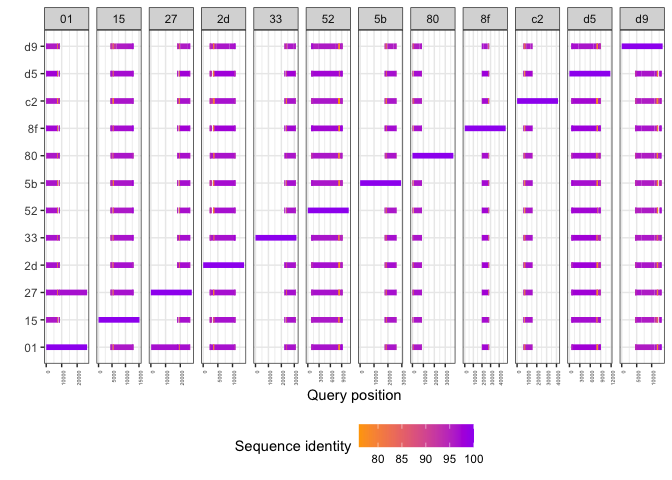
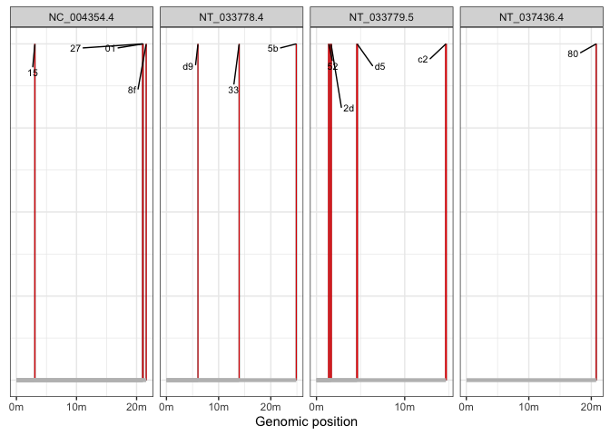

Kuruka
================

``` r
suppressPackageStartupMessages(library(tidyverse))
suppressPackageStartupMessages(library(knitr))
suppressPackageStartupMessages(library(kableExtra))
suppressPackageStartupMessages(library(ggpubr))
suppressPackageStartupMessages(library(svglite))
suppressPackageStartupMessages(library(ggrepel))
theme_set(theme_bw())
```

    RepeatMasker -pa 20 -no_is -s -nolow -dir ../RM-derecta -lib ../before-longreads/ref/kuruka-derecta.fasta TG_ND_dmel.fasta

``` r
columns_paf <- c("query","qlen","qstart","qend","strand","ref","reflen","refstart","refend","matching_bases","matching_including_gaps","quality")

(paf_derecta <- read_tsv("/Volumes/Storage/kuruka/minimap-derecta/minimap-output.paf", col_names = columns_paf) %>% filter(strand %in% c("+", "-")) %>% type_convert())
```

    ## Warning: One or more parsing issues, call `problems()` on your data frame for details,
    ## e.g.:
    ##   dat <- vroom(...)
    ##   problems(dat)

    ## Rows: 12 Columns: 18
    ## ── Column specification ────────────────────────────────────────────────────────
    ## Delimiter: "\t"
    ## chr (9): query, strand, ref, X13, X14, X15, X16, X17, X18
    ## dbl (9): qlen, qstart, qend, reflen, refstart, refend, matching_bases, match...
    ## 
    ## ℹ Use `spec()` to retrieve the full column specification for this data.
    ## ℹ Specify the column types or set `show_col_types = FALSE` to quiet this message.
    ## 
    ## ── Column specification ────────────────────────────────────────────────────────
    ## cols(
    ##   query = col_character(),
    ##   strand = col_character(),
    ##   ref = col_character(),
    ##   X13 = col_character(),
    ##   X14 = col_character(),
    ##   X15 = col_character(),
    ##   X16 = col_character(),
    ##   X17 = col_character(),
    ##   X18 = col_character()
    ## )

    ## # A tibble: 12 × 18
    ##    query    qlen qstart  qend strand ref   reflen refstart refend matching_bases
    ##    <chr>   <dbl>  <dbl> <dbl> <chr>  <chr>  <dbl>    <dbl>  <dbl>          <dbl>
    ##  1 JAEIGZ…  8738     64  8723 -      27e9…  27804    17875  26717           7097
    ##  2 JAEIGZ…  8738    106  8711 +      01d9…  26450        3   8788           7045
    ##  3 JAEIGZ…  8738     64  8717 -      2dd7…  13949     2227  11013           7031
    ##  4 JAEIGZ…  8738     64  8723 +      d566…  11770      566   9033           7039
    ##  5 JAEIGZ…  8738     64  8723 -      3327…  31631    22376  31189           6981
    ##  6 JAEIGZ…  8738     64  8723 +      8f0d…  47585    19905  28379           6994
    ##  7 JAEIGZ…  8738     69  8722 -      c2e4…  41569     6345  15580           6905
    ##  8 JAEIGZ…  8738     64  8581 -      80d3…  37412        7   8702           6687
    ##  9 JAEIGZ…  8738     75  8723 +      5257…  10878      912   9261           6725
    ## 10 JAEIGZ…  8738     64  8722 +      d94c…  13673     4459  13319           6665
    ## 11 JAEIGZ…  8738     64  8722 -      1584…  15181     4430  12977           6679
    ## 12 JAEIGZ…  8738     64  8723 -      5b9b…  29434    17657  26131           6670
    ## # ℹ 8 more variables: matching_including_gaps <dbl>, quality <dbl>, X13 <chr>,
    ## #   X14 <chr>, X15 <chr>, X16 <chr>, X17 <chr>, X18 <chr>

``` r
paf_derecta %>% select(ref) %>% write_tsv("/Volumes/Storage/kuruka/minimap-derecta/reads_with_kuruka.txt", col_names = FALSE)

paf_derecta %>% select(ref, refstart, refend, query, qlen, strand) %>% write_tsv("/Volumes/Storage/kuruka/minimap-derecta/reads_with_kuruka.bed", col_names = FALSE)
```

    grep -F -f ../minimap-derecta/reads_with_kuruka.txt tg_nd_dmel.fastq > ../minimap-derecta/reads_with_kuruka.fastq

    #Manually convert to fasta

    bedtools getfasta -fi /Volumes/Storage/kuruka/minimap-derecta/reads_with_kuruka.fasta -fo /Volumes/Storage/kuruka/minimap-derecta/matches-kuruka.fasta -s -bed /Volumes/Storage/kuruka/minimap-derecta/reads_with_kuruka.bed

    mafft -auto /Volumes/Storage/kuruka/minimap-derecta/matches-kuruka.fasta > /Volumes/Storage/kuruka/minimap-derecta/matches-kuruka.MSA

    python MSA2consensus.py /Volumes/Storage/kuruka/minimap-derecta/matches-kuruka.MSA /Volumes/Storage/kuruka/minimap-derecta/matches-kuruka.consensus.fasta

8833 bp consensus. 514 bp LTR, perfect match.

Where are the insertions in the D.melanogaster genome?

    blastn -query reads_with_kuruka.fasta -subject reads_with_kuruka.fasta -outfmt 6 -out reads_with_kuruka.blast.tsv

1.  They are all in different positions, as no flanking region is
    similar to any of the other 11. Only the TE is highly similar among
    reads (\>95%).

``` r
blast_columns <- c(
  "qseqid",    # Query sequence ID
  "sseqid",    # Subject (database match) sequence ID
  "pident",    # Percentage of identical matches
  "length",    # Alignment length
  "mismatch",  # Number of mismatches
  "gapopen",   # Number of gap openings
  "qstart",    # Start of alignment in query
  "qend",      # End of alignment in query
  "sstart",    # Start of alignment in subject
  "send",      # End of alignment in subject
  "evalue",    # Expect value (e-value)
  "bitscore"   # Bit score
)

blast <- read_tsv("/Volumes/Storage/kuruka/minimap-derecta/reads_with_kuruka.blast.tsv", col_names = blast_columns)
```

    ## Rows: 874 Columns: 12
    ## ── Column specification ────────────────────────────────────────────────────────
    ## Delimiter: "\t"
    ## chr  (2): qseqid, sseqid
    ## dbl (10): pident, length, mismatch, gapopen, qstart, qend, sstart, send, eva...
    ## 
    ## ℹ Use `spec()` to retrieve the full column specification for this data.
    ## ℹ Specify the column types or set `show_col_types = FALSE` to quiet this message.

``` r
blast_plot <- blast %>% filter(qseqid != sseqid | pident == 100) %>% mutate(qseqid_short = substr(qseqid, 1, 2), sseqid_short = substr(sseqid, 1, 2))

ggplot(blast_plot, aes(x = qstart, xend = qend, y = sseqid_short, yend = sseqid_short, color = pident)) +
  geom_segment(size = 2) +  
  scale_color_gradient(low = "orange", high = "purple") +  # Use a color gradient
  facet_grid(. ~ qseqid_short, scale = "free_x") +
  labs(x = "Query position", y = "", color = "Sequence identity") +
  theme(legend.position = "bottom", axis.text.x = element_text(angle = 90, hjust = 1, size = 4))
```

    ## Warning: Using `size` aesthetic for lines was deprecated in ggplot2 3.4.0.
    ## ℹ Please use `linewidth` instead.
    ## This warning is displayed once every 8 hours.
    ## Call `lifecycle::last_lifecycle_warnings()` to see where this warning was
    ## generated.

<!-- -->

2.  They are scattered among the main chromosomes

``` r
fai <- read_tsv("/Volumes/Storage/kuruka/ref/GCF_000001215.4_Release_6_plus_ISO1_MT_genomic.fna.fai", col_names = c("qseqid", "len"))
```

    ## Rows: 1870 Columns: 5
    ## ── Column specification ────────────────────────────────────────────────────────
    ## Delimiter: "\t"
    ## chr (1): qseqid
    ## dbl (4): len, X3, X4, X5
    ## 
    ## ℹ Use `spec()` to retrieve the full column specification for this data.
    ## ℹ Specify the column types or set `show_col_types = FALSE` to quiet this message.

``` r
(blast2reference <- read_tsv("/Volumes/Storage/kuruka/minimap-derecta/reads_with_kuruka.blast2reference.tsv", col_names = blast_columns) %>% mutate(sseqid_short = substr(sseqid, 1, 2)) %>% group_by(sseqid_short) %>% filter(length == max(length)) %>% inner_join(fai, by = "qseqid") %>% select(-mismatch, -gapopen, -sstart, -send, -X3, -X4, -X5, -evalue, -bitscore))
```

    ## Rows: 1618 Columns: 12
    ## ── Column specification ────────────────────────────────────────────────────────
    ## Delimiter: "\t"
    ## chr  (2): qseqid, sseqid
    ## dbl (10): pident, length, mismatch, gapopen, qstart, qend, sstart, send, eva...
    ## 
    ## ℹ Use `spec()` to retrieve the full column specification for this data.
    ## ℹ Specify the column types or set `show_col_types = FALSE` to quiet this message.

    ## # A tibble: 12 × 8
    ## # Groups:   sseqid_short [12]
    ##    qseqid      sseqid            pident length qstart   qend sseqid_short    len
    ##    <chr>       <chr>              <dbl>  <dbl>  <dbl>  <dbl> <chr>         <dbl>
    ##  1 NC_004354.4 8f0d4808-721b-4d…   98.2  18010 2.16e7 2.16e7 8f           2.35e7
    ##  2 NC_004354.4 27e9db99-9b8f-47…   97.6  15634 2.10e7 2.11e7 27           2.35e7
    ##  3 NC_004354.4 01d9a175-2765-4d…   97.8  15438 2.10e7 2.11e7 01           2.35e7
    ##  4 NC_004354.4 15840faa-b980-40…   97.5   2368 3.07e6 3.07e6 15           2.35e7
    ##  5 NT_033779.5 c2e40ece-673e-44…   97.4  15428 1.47e7 1.47e7 c2           2.35e7
    ##  6 NT_033779.5 2dd76f6c-12cd-41…   97.5   2952 1.65e6 1.65e6 2d           2.35e7
    ##  7 NT_033779.5 5257b8f0-f4c8-4b…   97.4   1627 1.41e6 1.41e6 52           2.35e7
    ##  8 NT_033779.5 d5667f51-91f8-4f…   95.6   1483 4.60e6 4.60e6 d5           2.35e7
    ##  9 NT_033778.4 3327a95b-1868-4e…   97.3  20241 1.39e7 1.40e7 33           2.53e7
    ## 10 NT_033778.4 5b9b2edc-7750-4c…   97.8   8196 2.49e7 2.49e7 5b           2.53e7
    ## 11 NT_033778.4 d94cf95b-c0a9-4f…   97.3   4498 6.04e6 6.05e6 d9           2.53e7
    ## 12 NT_037436.4 80d35ee7-2d67-42…   97.7  28977 2.08e7 2.08e7 80           2.81e7

``` r
ggplot(blast2reference) +
  geom_col(aes(x = qstart, y = 0.1), width = 200000, size = 0.1, color = "black", fill = "red") +  # Corrected geom_bar
  geom_segment(aes(x = qstart, xend = length, y = 0, yend = 0), size = 1.5, color = "grey") +  # Fixed segment
  scale_x_continuous(breaks = seq(0, max(blast2reference$qend), by = 1e7),  
                     labels = function(x) paste0(x / 1e6, "m")) +  # Format as "0m", "1m", ...
  labs(x = "Genomic position", fill = "Read ID") +
  theme(legend.position = "bottom",
        axis.text.y = element_blank(),  
        axis.title.y = element_blank(),  
        axis.ticks.y = element_blank()) +  
  facet_wrap(~qseqid, scales = "free_x", nrow = 1) +
  geom_text_repel(aes(x = qstart, y = 0.1, label = sseqid_short),  
                  size = 2.8, box.padding = 1, max.overlaps = 18, force = 1)
```

    ## Warning: `position_stack()` requires non-overlapping x intervals.

<!-- -->
