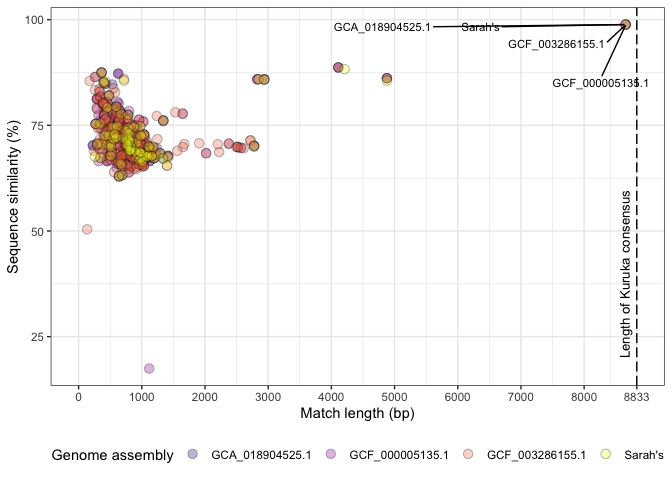

Kuruka
================

``` r
suppressPackageStartupMessages(library(tidyverse))
suppressPackageStartupMessages(library(knitr))
suppressPackageStartupMessages(library(kableExtra))
suppressPackageStartupMessages(library(ggpubr))
suppressPackageStartupMessages(library(svglite))
suppressPackageStartupMessages(library(ggrepel))
theme_set(theme_bw())
```

    for i in assemblies-derecta/*.fna; do RepeatMasker -pa 20 -no_is -s -nolow -dir RM-kuruka2erecta -lib ../ref/kuruka.fasta $i;done

``` r
columns_RM <- c("SWscore", "pdiv", "pdel", "pins", "contig", "qstart", "qend", "qleft",  "strand", "te", "class", "position_in_repeat_begin", "position_in_repeat_end", "position_in_repeat_left", "ID")

folder_path <- "/Volumes/Storage/kuruka/derecta/RM-kuruka2erecta/"
file_list <- list.files(path = folder_path, pattern = "\\.ori\\.out$", full.names = TRUE)

read_and_process <- function(file) {
  df <- read_table(file, col_names = columns_RM) %>%
    mutate(sample = basename(file))  # Add sample column with filename
  return(df)
}

combined_data <- map_dfr(file_list, read_and_process)
```

    ## 
    ## ── Column specification ────────────────────────────────────────────────────────
    ## cols(
    ##   SWscore = col_double(),
    ##   pdiv = col_double(),
    ##   pdel = col_double(),
    ##   pins = col_double(),
    ##   contig = col_character(),
    ##   qstart = col_double(),
    ##   qend = col_double(),
    ##   qleft = col_character(),
    ##   strand = col_character(),
    ##   te = col_character(),
    ##   class = col_character(),
    ##   position_in_repeat_begin = col_character(),
    ##   position_in_repeat_end = col_double(),
    ##   position_in_repeat_left = col_character(),
    ##   ID = col_logical()
    ## )
    ## 
    ## 
    ## ── Column specification ────────────────────────────────────────────────────────
    ## cols(
    ##   SWscore = col_double(),
    ##   pdiv = col_double(),
    ##   pdel = col_double(),
    ##   pins = col_double(),
    ##   contig = col_character(),
    ##   qstart = col_double(),
    ##   qend = col_double(),
    ##   qleft = col_character(),
    ##   strand = col_character(),
    ##   te = col_character(),
    ##   class = col_character(),
    ##   position_in_repeat_begin = col_character(),
    ##   position_in_repeat_end = col_double(),
    ##   position_in_repeat_left = col_character(),
    ##   ID = col_logical()
    ## )
    ## 
    ## 
    ## ── Column specification ────────────────────────────────────────────────────────
    ## cols(
    ##   SWscore = col_double(),
    ##   pdiv = col_double(),
    ##   pdel = col_double(),
    ##   pins = col_double(),
    ##   contig = col_character(),
    ##   qstart = col_double(),
    ##   qend = col_double(),
    ##   qleft = col_character(),
    ##   strand = col_character(),
    ##   te = col_character(),
    ##   class = col_character(),
    ##   position_in_repeat_begin = col_character(),
    ##   position_in_repeat_end = col_double(),
    ##   position_in_repeat_left = col_character(),
    ##   ID = col_logical()
    ## )
    ## 
    ## 
    ## ── Column specification ────────────────────────────────────────────────────────
    ## cols(
    ##   SWscore = col_double(),
    ##   pdiv = col_double(),
    ##   pdel = col_double(),
    ##   pins = col_double(),
    ##   contig = col_character(),
    ##   qstart = col_double(),
    ##   qend = col_double(),
    ##   qleft = col_character(),
    ##   strand = col_character(),
    ##   te = col_character(),
    ##   class = col_character(),
    ##   position_in_repeat_begin = col_character(),
    ##   position_in_repeat_end = col_double(),
    ##   position_in_repeat_left = col_character(),
    ##   ID = col_logical()
    ## )

``` r
defragmented <- combined_data %>% select(pdiv, sample, contig, qstart, qend, strand, position_in_repeat_begin, position_in_repeat_end, position_in_repeat_left) %>%
   arrange(sample, contig, qstart) %>%
   mutate(to_merge = ifelse(sample == lead(sample) & contig == lead(contig) & strand == lead(strand) & qend >= lead(qstart) - 250, TRUE, FALSE), match_len = qend-qstart)

(merged <- defragmented %>%
  mutate(
    qend = ifelse(to_merge, coalesce(lead(qend), qend), qend),  # Avoids NA issues in last row
    pdiv = ifelse(to_merge, (pdiv/100) * (match_len/(qend-qstart)) + (lead(pdiv)/100) * (lead(match_len)/(qend-qstart)), pdiv),
    match_len = qend-qstart,
    pdiv = pdiv * 100) %>%
  filter(to_merge == TRUE) %>%
  select(sample, contig, qstart, qend, match_len, pdiv, strand) %>%
  mutate(name = case_when(sample == "GCA_018904525.1_ASM1890452v1_genomic.fna.ori.out" ~ "GCA_018904525.1", sample == "GCF_000005135.1_dere_caf1_genomic.fna.ori.out" ~ "GCF_000005135.1", sample == "GCF_003286155.1_DereRS2_genomic.fna.ori.out" ~ "GCF_003286155.1", sample == "derecta.contigs.fna.ori.out" ~ "Sarah's")))
```

    ## # A tibble: 691 × 8
    ##    sample                      contig qstart   qend match_len  pdiv strand name 
    ##    <chr>                       <chr>   <dbl>  <dbl>     <dbl> <dbl> <chr>  <chr>
    ##  1 GCA_018904525.1_ASM1890452… JAEIG… 5.92e5 5.93e5       946  28.7 +      GCA_…
    ##  2 GCA_018904525.1_ASM1890452… JAEIG… 1.16e6 1.16e6      1035  27.2 +      GCA_…
    ##  3 GCA_018904525.1_ASM1890452… JAEIG… 1.34e6 1.34e6       961  33.2 +      GCA_…
    ##  4 GCA_018904525.1_ASM1890452… JAEIG… 3.01e5 3.02e5       516  26.3 +      GCA_…
    ##  5 GCA_018904525.1_ASM1890452… JAEIG… 9.74e5 9.75e5      1042  32.2 +      GCA_…
    ##  6 GCA_018904525.1_ASM1890452… JAEIG… 3.06e4 3.13e4       778  30.0 +      GCA_…
    ##  7 GCA_018904525.1_ASM1890452… JAEIG… 1.68e5 1.68e5       534  27.8 +      GCA_…
    ##  8 GCA_018904525.1_ASM1890452… JAEIG… 1.68e5 1.69e5       480  18.0 +      GCA_…
    ##  9 GCA_018904525.1_ASM1890452… JAEIG… 1.69e5 1.69e5       625  22.7 +      GCA_…
    ## 10 GCA_018904525.1_ASM1890452… JAEIG… 2.67e5 2.68e5       803  28.8 C      GCA_…
    ## # ℹ 681 more rows

``` r
# Create a data frame for the custom label
label_data <- data.frame(x = 8650, y = 20, label = "Length of Kuruka consensus", name = NA)

(insertions_dere <- ggplot(merged, aes(x = match_len, y = 100 - pdiv, fill = name)) + 
  geom_point(shape = 21, size = 3, alpha = 0.3, color = "black") +  # Shape 21 = dots with border
  scale_fill_viridis_d(option = "plasma", na.translate = FALSE) +
  geom_text_repel(data = merged %>% filter(match_len > 5000), 
                  aes(label = name), size = 3, box.padding = 0.8, max.overlaps = 15) + 
  geom_vline(xintercept = 8833, linetype = "longdash") +  # Vertical line at 8833
  geom_text(data = label_data, aes(x = x, y = y, label = label), angle = 90, hjust = 0, size = 3.5) +  # Custom label
  labs(x = "Match length (bp)", y = "Sequence similarity (%)", fill = "Genome assembly") + 
  scale_x_continuous(breaks = c(seq(0, 8000, by = 1000), 8833), limits = c(0, 8833)) +  # Set custom x-axis breaks
  theme(legend.position = "bottom"))
```

<!-- -->

``` r
ggsave("/Volumes/Storage/kuruka/figures/exploratory/derecta-insertions.png", insertions_dere, dpi = 500)
```

    ## Saving 7 x 5 in image

``` r
samples_list <- merged %>% select(sample) %>% distinct() %>% pull

for (s in samples_list) {
  sample <- merged %>% filter(sample == s, pdiv < 2, match_len > 6000) %>% select(contig, qstart, qend, name, strand) %>% mutate(qstart = ifelse(qstart-2000>0, qstart-2000, 0), qend = qend+2000)
  path <- paste0("/Volumes/Storage/kuruka/derecta/insertions-derecta/", s, ".bed")
  write_tsv(sample, path, col_names = FALSE)
}
```

    cd /Volumes/Storage/kuruka/RM-derecta/insertions-derecta
    bedtools getfasta -fi ../assemblies-derecta/GCA_018904525.1_ASM1890452v1_genomic.fna -fo GCA_018904525.1_ASM1890452v1_genomic.fna.ori.out.fasta -bed GCA_018904525.1_ASM1890452v1_genomic.fna.ori.out.bed -s
    bedtools getfasta -fi ../assemblies-derecta/GCF_003286155.1_DereRS2_genomic.fna -fo GCF_003286155.1_DereRS2_genomic.fna.ori.out.fasta -bed GCF_003286155.1_DereRS2_genomic.fna.ori.out.bed -s
    bedtools getfasta -fi ../assemblies-derecta/GCF_000005135.1_dere_caf1_genomic.fna -fo GCF_000005135.1_dere_caf1_genomic.fna.ori.out.fasta -bed GCF_000005135.1_dere_caf1_genomic.fna.ori.out.bed -s
    bedtools getfasta -fi ../assemblies-derecta/derecta.contigs.fna -fo derecta.contigs.fna.ori.out.fasta -bed derecta.contigs.fna.ori.out.bed -s
    cat *fasta > insertions-kuruka-derecta.fna

The insertions are at the same site. The flanking regions are \>99.9% in
the 4 assemblies!

Short reads

``` r
# Define the folder containing the copynumber files
folder_path <- "/Volumes/Storage/kuruka/derecta/deviaTE/"

columns <- c("TEfam", "sample_id", "pos", "refbase", "A", "C", "G", "T", "cov", "phys_cov", "hq_cov", "snp", "refsnp", "int_del", "int_del_freq", "trunc_left", "trunc_right", "ins", "delet", "annotation")

# List all *.ori.out files in the folder
file_list <- list.files(path = folder_path, pattern = "\\.Kuruka$", full.names = TRUE)

# Iterate over each file in oriout_folder
all_cn_data <- tibble()

for (cn_file in file_list) {
  cn <- read_table(cn_file, col_names = columns, skip = 3) %>% mutate(sample = cn_file) %>% filter(pos < 8830 | pos > 0) %>% group_by(sample) %>% summarise(copynumber = mean(hq_cov), more_than1 = sum(hq_cov >= 0.1)) %>% mutate(presence = ifelse(more_than1 > 7005, "present", "absent"))
  all_cn_data <- bind_rows(all_cn_data, cn)
  }
```

    ## 
    ## ── Column specification ────────────────────────────────────────────────────────
    ## cols(
    ##   .default = col_double(),
    ##   TEfam = col_character(),
    ##   sample_id = col_character(),
    ##   refbase = col_character(),
    ##   snp = col_logical(),
    ##   refsnp = col_logical(),
    ##   int_del = col_logical(),
    ##   int_del_freq = col_logical(),
    ##   ins = col_logical(),
    ##   delet = col_logical(),
    ##   annotation = col_logical()
    ## )
    ## ℹ Use `spec()` for the full column specifications.

    ## Warning: 3 parsing failures.
    ##  row   col           expected         actual                                                                        file
    ## 7106 delet 1/0/T/F/TRUE/FALSE 7106:7108:0.35 '/Volumes/Storage/kuruka/derecta/deviaTE//SRR1977503.fastq.sort.bam.Kuruka'
    ## 7655 delet 1/0/T/F/TRUE/FALSE 7655:7658:0.21 '/Volumes/Storage/kuruka/derecta/deviaTE//SRR1977503.fastq.sort.bam.Kuruka'
    ## 8186 ins   1/0/T/F/TRUE/FALSE 8186:8191:0.21 '/Volumes/Storage/kuruka/derecta/deviaTE//SRR1977503.fastq.sort.bam.Kuruka'

    ## 
    ## ── Column specification ────────────────────────────────────────────────────────
    ## cols(
    ##   .default = col_double(),
    ##   TEfam = col_character(),
    ##   sample_id = col_character(),
    ##   refbase = col_character(),
    ##   snp = col_logical(),
    ##   refsnp = col_logical(),
    ##   int_del = col_logical(),
    ##   int_del_freq = col_logical(),
    ##   ins = col_logical(),
    ##   delet = col_logical(),
    ##   annotation = col_logical()
    ## )
    ## ℹ Use `spec()` for the full column specifications.

    ## Warning: 5 parsing failures.
    ##  row   col           expected          actual                                                                        file
    ## 4927 delet 1/0/T/F/TRUE/FALSE 4927:4930:0.092 '/Volumes/Storage/kuruka/derecta/deviaTE//SRR1977539.fastq.sort.bam.Kuruka'
    ## 6256 delet 1/0/T/F/TRUE/FALSE 6256:6258:0.245 '/Volumes/Storage/kuruka/derecta/deviaTE//SRR1977539.fastq.sort.bam.Kuruka'
    ## 6680 delet 1/0/T/F/TRUE/FALSE 6680:6686:0.123 '/Volumes/Storage/kuruka/derecta/deviaTE//SRR1977539.fastq.sort.bam.Kuruka'
    ## 7689 ins   1/0/T/F/TRUE/FALSE 7689:7693:0.184 '/Volumes/Storage/kuruka/derecta/deviaTE//SRR1977539.fastq.sort.bam.Kuruka'
    ## 8186 ins   1/0/T/F/TRUE/FALSE 8186:8191:0.153 '/Volumes/Storage/kuruka/derecta/deviaTE//SRR1977539.fastq.sort.bam.Kuruka'

    ## 
    ## ── Column specification ────────────────────────────────────────────────────────
    ## cols(
    ##   .default = col_double(),
    ##   TEfam = col_character(),
    ##   sample_id = col_character(),
    ##   refbase = col_character(),
    ##   snp = col_logical(),
    ##   refsnp = col_logical(),
    ##   int_del = col_logical(),
    ##   int_del_freq = col_logical(),
    ##   ins = col_logical(),
    ##   delet = col_logical(),
    ##   annotation = col_logical()
    ## )
    ## ℹ Use `spec()` for the full column specifications.

    ## Warning: 6 parsing failures.
    ##  row   col           expected          actual                                                                        file
    ## 2540 delet 1/0/T/F/TRUE/FALSE 2540:2544:0.085 '/Volumes/Storage/kuruka/derecta/deviaTE//SRR1977582.fastq.sort.bam.Kuruka'
    ## 4927 delet 1/0/T/F/TRUE/FALSE 4927:4930:0.128 '/Volumes/Storage/kuruka/derecta/deviaTE//SRR1977582.fastq.sort.bam.Kuruka'
    ## 6256 delet 1/0/T/F/TRUE/FALSE 6256:6258:0.085 '/Volumes/Storage/kuruka/derecta/deviaTE//SRR1977582.fastq.sort.bam.Kuruka'
    ## 7018 ins   1/0/T/F/TRUE/FALSE 7018:7025:0.17  '/Volumes/Storage/kuruka/derecta/deviaTE//SRR1977582.fastq.sort.bam.Kuruka'
    ## 7385 ins   1/0/T/F/TRUE/FALSE 7385:7387:0.085 '/Volumes/Storage/kuruka/derecta/deviaTE//SRR1977582.fastq.sort.bam.Kuruka'
    ## .... ..... .................. ............... ...........................................................................
    ## See problems(...) for more details.

    ## 
    ## ── Column specification ────────────────────────────────────────────────────────
    ## cols(
    ##   .default = col_double(),
    ##   TEfam = col_character(),
    ##   sample_id = col_character(),
    ##   refbase = col_character(),
    ##   snp = col_logical(),
    ##   refsnp = col_logical(),
    ##   int_del = col_logical(),
    ##   int_del_freq = col_logical(),
    ##   ins = col_logical(),
    ##   delet = col_character(),
    ##   annotation = col_logical()
    ## )
    ## ℹ Use `spec()` for the full column specifications.

    ## Warning: 2 parsing failures.
    ##  row col           expected          actual                                                                        file
    ## 7018 ins 1/0/T/F/TRUE/FALSE 7018:7025:0.097 '/Volumes/Storage/kuruka/derecta/deviaTE//SRR1977589.fastq.sort.bam.Kuruka'
    ## 7689 ins 1/0/T/F/TRUE/FALSE 7689:7693:0.161 '/Volumes/Storage/kuruka/derecta/deviaTE//SRR1977589.fastq.sort.bam.Kuruka'

``` r
print(all_cn_data)
```

    ## # A tibble: 4 × 4
    ##   sample                                          copynumber more_than1 presence
    ##   <chr>                                                <dbl>      <int> <chr>   
    ## 1 /Volumes/Storage/kuruka/derecta/deviaTE//SRR19…      0.583       7651 present 
    ## 2 /Volumes/Storage/kuruka/derecta/deviaTE//SRR19…      0.458       7342 present 
    ## 3 /Volumes/Storage/kuruka/derecta/deviaTE//SRR19…      0.367       7636 present 
    ## 4 /Volumes/Storage/kuruka/derecta/deviaTE//SRR19…      0.454       7304 present

``` r
write_tsv(all_cn_data, "/Volumes/Storage/kuruka/derecta/deviaTE/kuruka-copynumber-nolowcomplexity.tsv")
```
