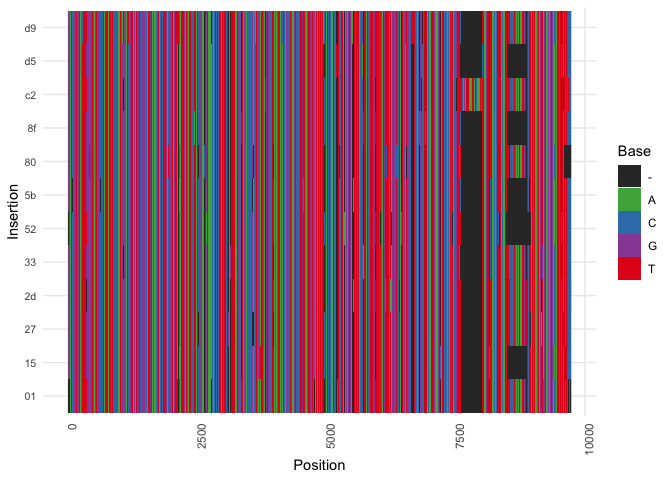
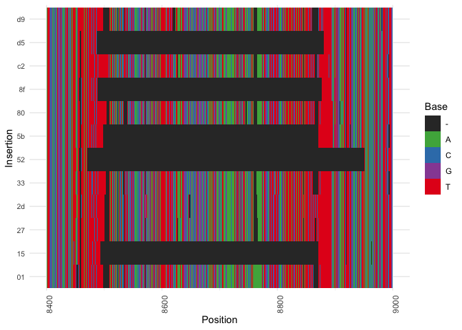
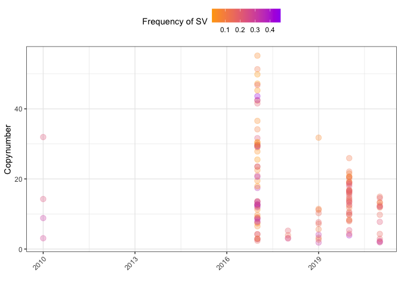
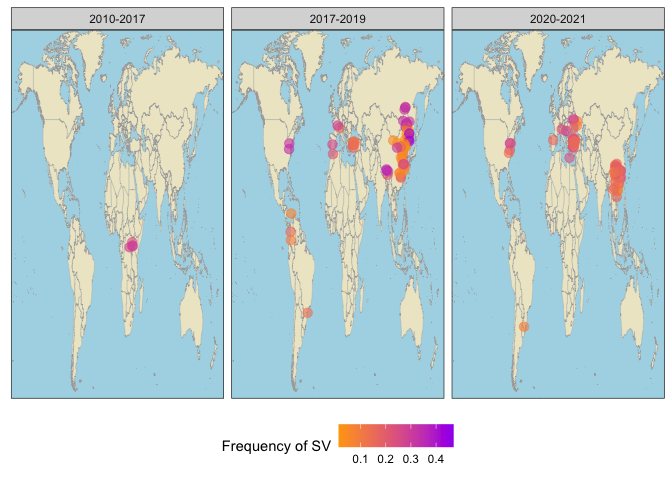

Kuruka
================

``` r
suppressPackageStartupMessages(library(tidyverse))
suppressPackageStartupMessages(library(knitr))
suppressPackageStartupMessages(library(kableExtra))
suppressPackageStartupMessages(library(ggpubr))
suppressPackageStartupMessages(library(svglite))
library(Biostrings)
```

    ## Loading required package: BiocGenerics

    ## 
    ## Attaching package: 'BiocGenerics'

    ## The following objects are masked from 'package:lubridate':
    ## 
    ##     intersect, setdiff, union

    ## The following objects are masked from 'package:dplyr':
    ## 
    ##     combine, intersect, setdiff, union

    ## The following objects are masked from 'package:stats':
    ## 
    ##     IQR, mad, sd, var, xtabs

    ## The following objects are masked from 'package:base':
    ## 
    ##     anyDuplicated, aperm, append, as.data.frame, basename, cbind,
    ##     colnames, dirname, do.call, duplicated, eval, evalq, Filter, Find,
    ##     get, grep, grepl, intersect, is.unsorted, lapply, Map, mapply,
    ##     match, mget, order, paste, pmax, pmax.int, pmin, pmin.int,
    ##     Position, rank, rbind, Reduce, rownames, sapply, setdiff, sort,
    ##     table, tapply, union, unique, unsplit, which.max, which.min

    ## Loading required package: S4Vectors

    ## Warning: package 'S4Vectors' was built under R version 4.2.2

    ## Loading required package: stats4

    ## 
    ## Attaching package: 'S4Vectors'

    ## The following objects are masked from 'package:lubridate':
    ## 
    ##     second, second<-

    ## The following objects are masked from 'package:dplyr':
    ## 
    ##     first, rename

    ## The following object is masked from 'package:tidyr':
    ## 
    ##     expand

    ## The following objects are masked from 'package:base':
    ## 
    ##     expand.grid, I, unname

    ## Loading required package: IRanges

    ## 
    ## Attaching package: 'IRanges'

    ## The following object is masked from 'package:lubridate':
    ## 
    ##     %within%

    ## The following objects are masked from 'package:dplyr':
    ## 
    ##     collapse, desc, slice

    ## The following object is masked from 'package:purrr':
    ## 
    ##     reduce

    ## Loading required package: XVector

    ## 
    ## Attaching package: 'XVector'

    ## The following object is masked from 'package:purrr':
    ## 
    ##     compact

    ## Loading required package: GenomeInfoDb

    ## Warning: package 'GenomeInfoDb' was built under R version 4.2.2

    ## 
    ## Attaching package: 'Biostrings'

    ## The following object is masked from 'package:base':
    ## 
    ##     strsplit

``` r
theme_set(theme_bw())
```

``` r
msa <- readDNAMultipleAlignment("/Volumes/Storage/kuruka/minimap-derecta/matches-kuruka.MSA", format = "fasta")
msa_matrix <- as.matrix(msa)
df <- as.data.frame(msa_matrix)

base_colors <- c("A" = "#4DAF4A",  # Green
                 "T" = "#E41A1C",  # Red
                 "C" = "#377EB8",  # Blue
                 "G" = "#984EA3",  # Purple
                 "-" = "#333333")  # Dark gray for gaps

(df_long <- as_tibble(df) %>%
  mutate(insertion = rownames(df)) %>%  # Add row names as a new column
  pivot_longer(cols = -insertion,      # Pivot all columns except 'insertion'
               names_to = "position", # Column names become 'position'
               values_to = "base") %>%
  mutate(position = gsub("V", "", position)) %>% type_convert() %>% mutate(insertion_id = substr(insertion, 1, 2)))
```

    ## 
    ## ── Column specification ────────────────────────────────────────────────────────
    ## cols(
    ##   insertion = col_character(),
    ##   position = col_double(),
    ##   base = col_character()
    ## )

    ## # A tibble: 116,712 × 4
    ##    insertion                                         position base  insertion_id
    ##    <chr>                                                <dbl> <chr> <chr>       
    ##  1 27e9db99-9b8f-4760-a8fc-b997844d014c:17875-26717…        1 G     27          
    ##  2 27e9db99-9b8f-4760-a8fc-b997844d014c:17875-26717…        2 A     27          
    ##  3 27e9db99-9b8f-4760-a8fc-b997844d014c:17875-26717…        3 A     27          
    ##  4 27e9db99-9b8f-4760-a8fc-b997844d014c:17875-26717…        4 T     27          
    ##  5 27e9db99-9b8f-4760-a8fc-b997844d014c:17875-26717…        5 G     27          
    ##  6 27e9db99-9b8f-4760-a8fc-b997844d014c:17875-26717…        6 T     27          
    ##  7 27e9db99-9b8f-4760-a8fc-b997844d014c:17875-26717…        7 G     27          
    ##  8 27e9db99-9b8f-4760-a8fc-b997844d014c:17875-26717…        8 G     27          
    ##  9 27e9db99-9b8f-4760-a8fc-b997844d014c:17875-26717…        9 T     27          
    ## 10 27e9db99-9b8f-4760-a8fc-b997844d014c:17875-26717…       10 T     27          
    ## # ℹ 116,702 more rows

``` r
ggplot(df_long, aes(x = position, y = insertion_id, fill = base)) +
  geom_tile() +
  scale_fill_manual(values = base_colors) +
  labs(x = "Position", y = "Insertion", fill = "Base") +
  theme_minimal() +
  theme(axis.text.x = element_text(angle = 90, hjust = 1), 
        axis.text.y = element_text(size = 8))
```

<!-- -->

``` r
df_long_zoom <- df_long %>% filter(position > 8400, position < 9000)

ggplot(df_long_zoom, aes(x = position, y = insertion_id, fill = base)) +
  geom_tile() +
  scale_fill_manual(values = base_colors) +
  labs(x = "Position", y = "Insertion", fill = "Base") +
  theme_minimal() +
  theme(axis.text.x = element_text(angle = 90, hjust = 1), 
        axis.text.y = element_text(size = 8))
```

<!-- -->

``` r
(deviaTE <- read_tsv("/Volumes/Storage/kuruka/deviaTE/kuruka-deviate.tsv"))
```

    ## Warning: One or more parsing issues, call `problems()` on your data frame for details,
    ## e.g.:
    ##   dat <- vroom(...)
    ##   problems(dat)

    ## Rows: 9468976 Columns: 21
    ## ── Column specification ────────────────────────────────────────────────────────
    ## Delimiter: "\t"
    ## chr  (4): TEfam, sample_id, refbase, sample
    ## dbl (10): pos, A, C, G, T, cov, phys_cov, hq_cov, trunc_left, trunc_right
    ## lgl  (7): snp, refsnp, int_del, int_del_freq, ins, delet, annotation
    ## 
    ## ℹ Use `spec()` to retrieve the full column specification for this data.
    ## ℹ Specify the column types or set `show_col_types = FALSE` to quiet this message.

    ## # A tibble: 9,468,976 × 21
    ##    TEfam  sample_id    pos refbase     A     C     G     T   cov phys_cov hq_cov
    ##    <chr>  <chr>      <dbl> <chr>   <dbl> <dbl> <dbl> <dbl> <dbl>    <dbl>  <dbl>
    ##  1 Kuruka Conocotoc…     0 G           0     0     0     0     0        0      0
    ##  2 Kuruka Conocotoc…     1 A           0     0     0     0     0        0      0
    ##  3 Kuruka Conocotoc…     2 A           0     0     0     0     0        0      0
    ##  4 Kuruka Conocotoc…     3 T           0     0     0     0     0        0      0
    ##  5 Kuruka Conocotoc…     4 G           0     0     0     0     0        0      0
    ##  6 Kuruka Conocotoc…     5 T           0     0     0     0     0        0      0
    ##  7 Kuruka Conocotoc…     6 G           0     0     0     0     0        0      0
    ##  8 Kuruka Conocotoc…     7 G           0     0     0     0     0        0      0
    ##  9 Kuruka Conocotoc…     8 T           0     0     0     0     0        0      0
    ## 10 Kuruka Conocotoc…     9 T           0     0     0     0     0        0      0
    ## # ℹ 9,468,966 more rows
    ## # ℹ 10 more variables: snp <lgl>, refsnp <lgl>, int_del <lgl>,
    ## #   int_del_freq <lgl>, trunc_left <dbl>, trunc_right <dbl>, ins <lgl>,
    ## #   delet <lgl>, annotation <lgl>, sample <chr>

``` r
metadata <- read_tsv("/Volumes/Storage/kuruka/metadata/dmel-metadata-DEST2.tsv")
```

    ## Rows: 1118 Columns: 9
    ## ── Column specification ────────────────────────────────────────────────────────
    ## Delimiter: "\t"
    ## chr (6): sample, strain, publication, study, study_id, location
    ## dbl (3): year, lat, lon
    ## 
    ## ℹ Use `spec()` to retrieve the full column specification for this data.
    ## ℹ Specify the column types or set `show_col_types = FALSE` to quiet this message.

``` r
period_order <- c("<2010", "2010-2017", "2017-2019", "2020-2021")

copynumber_kuruka <- read_tsv("/Volumes/Storage/kuruka/deviaTE/kuruka-copynumber-nolowcomplexity.tsv") %>% mutate(sample = gsub("/Volumes/Storage/kuruka/deviaTE/raw-data//", "", sample), sample = gsub(".fastq.sort.bam.Kuruka", "", sample)) %>% select(sample, presence, copynumber)
```

    ## Rows: 1072 Columns: 4
    ## ── Column specification ────────────────────────────────────────────────────────
    ## Delimiter: "\t"
    ## chr (2): sample, presence
    ## dbl (2): copynumber, more_than1
    ## 
    ## ℹ Use `spec()` to retrieve the full column specification for this data.
    ## ℹ Specify the column types or set `show_col_types = FALSE` to quiet this message.

``` r
copynumbers <- deviaTE %>%
  mutate(SV = ifelse(pos > 7669 & pos < 8001, "SV", "other_sequence"), sample = gsub(".fastq.sort.bam", "", sample_id)) %>%
  group_by(sample, SV) %>%
  summarise(copynumber_part = mean(cov)) %>%
  inner_join(metadata, by = "sample") %>% inner_join(copynumber_kuruka, by = "sample") %>%
  filter(presence == "present")
```

    ## `summarise()` has grouped output by 'sample'. You can override using the
    ## `.groups` argument.

``` r
freq <- copynumbers %>% pivot_wider(names_from = SV, values_from = copynumber_part) %>% mutate(SV_frequency = SV/(SV+other_sequence)) %>% mutate(period = case_when(year<2010 ~ "<2010", year>=2010 & year<2017 ~ "2010-2017", year>=2017 & year < 2020 ~ "2017-2019", TRUE ~ "2020-2021"), period = factor(period, levels = period_order))
```

``` r
world_map <- map_data("world") %>% filter(region != "Antarctica")

(kuruka_timeline <- ggplot(freq, aes(x = year, y = copynumber, color = SV_frequency)) +
        geom_point(alpha = 0.3, size = 3) +
        labs(y = "Copynumber", x = "", color = "Frequency of SV") +
        scale_color_gradient(low = "orange", high = "purple") +
        #scale_color_manual(values = c("darkgreen", "red")) +
        theme(legend.position = "top", 
              axis.text.x = element_text(angle = 45, hjust = 1)))
```

<!-- -->

``` r
(c8_map <- ggplot() +
        geom_map(data = world_map, map = world_map, 
                 aes(long, lat, map_id = region), 
                 fill = "cornsilk2", color = "darkgrey", linewidth = 0.1) +
        geom_point(data = freq, 
                   aes(x = lon, y = lat, color = SV_frequency), 
                  size = 3, position = position_jitter(width = 2, height = 2), alpha = 0.6) +
        scale_color_gradient(low = "orange", high = "purple") +
    #scale_color_manual(values = c("darkgreen", "red")) +
       theme(plot.title = element_text(hjust = 0.5), 
              axis.text = element_blank(), 
              axis.title = element_blank(), 
              axis.ticks = element_blank(), 
              legend.position = "bottom", 
              panel.grid = element_blank(), 
             panel.background = element_rect(fill = "lightblue")) +
        facet_wrap(~period) +
        labs(color = "Frequency of SV") +
       coord_cartesian(expand = FALSE))
```

    ## Warning in geom_map(data = world_map, map = world_map, aes(long, lat, map_id =
    ## region), : Ignoring unknown aesthetics: x and y

<!-- -->
