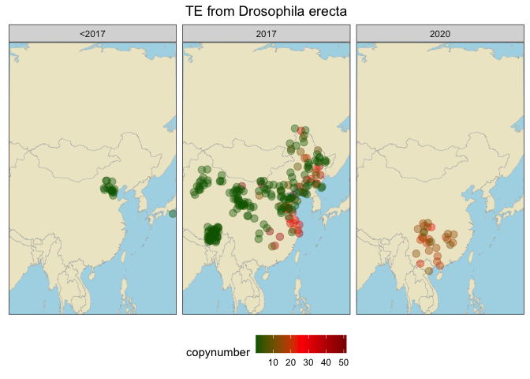

From raw output to TE library
================

``` r
suppressPackageStartupMessages(library(tidyverse))
suppressPackageStartupMessages(library(knitr))
suppressPackageStartupMessages(library(kableExtra))
suppressPackageStartupMessages(library(ggpubr))
suppressPackageStartupMessages(library(svglite))
theme_set(theme_bw())
```

Call the pipeline on all of our D. melanogaster short reads data.

    ls /mnt/data2/riccardo/dmel-china/merged/*.fastq.gz | parallel -j 4 bash GenomeDelta2.sh {} ../dmel-data/Dmel-reference.fna ../dmel-data/human-wolbachia-bacteria.fasta ../test-china3 50 --identity_threshold 0.05 --alignment_length_threshold 0.9

Call the output-filter script. It takes all the fasta files from one
batch, filter them by keeping only significant matches (length \> 500
and \< 10000, coverage \> 30). Then it clusters the sequences to remove
redundancy (90% identity, 250 minimum match length). Then it blastX
against a TE proteins database and keep only sequences with TE features
(match lenght \> 100, identity \> 35).

    bash GenomeDelta2-output-filter.sh \                                                           
        --input_folder ../OUTPUT/china \
        --output_folder ../OUTPUT/china-candidates \
        --min 500 \
        --max 10000 \
        --cov 30 \
        --output_prefix china \
        --blast_identity 90 \
        --min_match_len 250

Reclustering with very stringent identity but lower length, to put
together fragments of the same TE. BLASTn to 285 Drosophilids assemblies
to find matches. BLASTn to newTEs (Pele, Spoink, MLE, Souslik,
Transib1). They are our control (should BE in the dataset).

    python clustering.py --input_fasta ../OUTPUT/dmel/TE-candidates.fasta --output_folder ../OUTPUT/dmel/reclustering --blast_identity 99 --min_match_len 100

    for cluster_file in reclustering/*.fasta; do [[ -f "$cluster_file" ]] && awk -v cluster_name="$(basename "$cluster_file" .fasta)" '/^>/ {if (s) exit; print ">" cluster_name "_" substr($0,2); s=1; next} s {print}' "$cluster_file" >> /Volumes/Storage/mining/GenomeDelta2.0/OUTPUT/dmel/TE-candidates-reclustered.fasta; done

    for QUERY in /Volumes/Storage/data/285assemblies/285assemblies/*.fasta; do \
        blastn -query "$QUERY" -subject /Volumes/Storage/mining/GenomeDelta2.0/OUTPUT/china+others/TE-candidates-reclustered.fasta -outfmt 6 |awk -v file="$(basename "$QUERY")" '{print file "\t" $0}' >> /Volumes/Storage/mining/GenomeDelta2.0/OUTPUT/china+others/blast285assemblies.tsv; done
        
    blastn -query /Volumes/Storage/mining/GenomeDelta2.0/utilities/new-TEs.fasta -subject /Volumes/Storage/mining/GenomeDelta2.0/OUTPUT/china+others/TE-candidates-reclustered.fasta -outfmt 6 > /Volumes/Storage/mining/GenomeDelta2.0/OUTPUT/china+others/blast-SpoinkMLESouslikTransib1.tsv

Removed clusters matching note TEs (\>97% similarity for more than 300
bp). Concatenated known DmelTEs to the cleaned library of candidates
(for competitive mapping of different variants of the TE), together with
3 scgs found by BUSCO (teGD2-teDMEL-scgs.fasta). Mapping of all the
short-reads to the candidates.

    find /mnt/data2/riccardo/dmel-shortreads/ -name "*.fastq.gz" | parallel -j 5 'n={/.}; bwa bwasw -t 10 ref/teGD2-teDMEL-scgs.fasta {} | samtools sort -@ 10 -m 3G -o mapped2candidates/${n}.sort.bam'

    parallel -j 40 "samtools index {}" ::: *.bam

    find . -name '*.bam' | parallel -j 40 'n={/.}; samtools view {} | python /mnt/data1/riccardo/failed-TEs/D.melanogaster/dmel-mapstat-weight.py --sam - --fai /mnt/data1/riccardo/failed-TEs/D.melanogaster/ref/teGD2-teDMEL-scgs.fasta.fai --min-mq 0 > /mnt/data1/riccardo/failed-TEs/D.melanogaster/mapped2candidates/copynumber/${n}.tsv'

    # Define the folder containing the copynumber files
    folder_path <- "/Volumes/Storage/mining/GenomeDelta2.0/OUTPUT/dmel-validation/copynumber"

    columns <- c("type","name","len","raw","copynumber")

    # List all *.ori.out files in the folder
    file_list <- list.files(path = folder_path, pattern = "\\.tsv$", full.names = TRUE)

    # Iterate over each file in oriout_folder
    all_cn_data <- tibble(sample = character(), type = character(), name = character(), len = integer(), raw = integer(), copynumber = double())

    for (cn_file in file_list) {
      cn <- read_tsv(cn_file, col_names = columns, skip = 6) %>% mutate(sample = cn_file)
      print(cn_file)
      all_cn_data <- bind_rows(all_cn_data, cn)
      }
      
    write_tsv(all_cn_data, "/Volumes/Storage/mining/GenomeDelta2.0/OUTPUT/dmel-validation/copynumber.tsv")

``` r
metadata <- read_tsv("/Volumes/Storage/mining/GenomeDelta2.0/utilities/dmel-metadata.tsv")
```

    ## Rows: 879 Columns: 9
    ## ── Column specification ────────────────────────────────────────────────────────
    ## Delimiter: "\t"
    ## chr (6): sample, strain, publication, study, study_id, location
    ## dbl (3): year, lat, lon
    ## 
    ## ℹ Use `spec()` to retrieve the full column specification for this data.
    ## ℹ Specify the column types or set `show_col_types = FALSE` to quiet this message.

``` r
(cn <- read_tsv("/Volumes/Storage/mining/GenomeDelta2.0/OUTPUT/dmel-validation/copynumber.tsv") %>% mutate(sample = gsub("/Volumes/Storage/mining/GenomeDelta2.0/OUTPUT/dmel-validation/copynumber/", "", sample), sample = gsub(".fastq.sort.tsv", "", sample)) %>% inner_join(metadata, by="sample") %>% arrange(desc(copynumber)) %>% filter(str_detect(name, "cluster"))) #%>% filter(study_id!="Shpak2023, sample!="SRR1525770", sample!="SRR14306821"))
```

    ## Rows: 223660 Columns: 6
    ## ── Column specification ────────────────────────────────────────────────────────
    ## Delimiter: "\t"
    ## chr (3): sample, type, name
    ## dbl (3): len, raw, copynumber
    ## 
    ## ℹ Use `spec()` to retrieve the full column specification for this data.
    ## ℹ Specify the column types or set `show_col_types = FALSE` to quiet this message.

    ## # A tibble: 65,520 × 14
    ##    sample  type  name    len    raw copynumber strain publication study study_id
    ##    <chr>   <chr> <chr> <dbl>  <dbl>      <dbl> <chr>  <chr>       <chr> <chr>   
    ##  1 SRR238… te    clus…  2791 6.78e6     50196. H6     https://do… PRJN… Shpak20…
    ##  2 SRR238… te    clus…  2791 3.37e7     36571. H5     https://do… PRJN… Shpak20…
    ##  3 SRR238… te    clus…  2791 6.26e6     24517. H3     https://do… PRJN… Shpak20…
    ##  4 SRR238… te    clus…  2791 2.59e6     23427. H2     https://do… PRJN… Shpak20…
    ##  5 SRR238… te    clus…  2791 6.10e6     17356. H4     https://do… PRJN… Shpak20…
    ##  6 SRR238… te    clus…  2791 9.97e6     17005. H7     https://do… PRJN… Shpak20…
    ##  7 SRR238… te    clus…  2791 6.59e6     15261. H12    https://do… PRJN… Shpak20…
    ##  8 SRR238… te    clus…  2791 5.56e6     13425. H16    https://do… PRJN… Shpak20…
    ##  9 SRR238… te    clus…  2791 4.54e6     11359. H13    https://do… PRJN… Shpak20…
    ## 10 SRR238… te    clus…  2791 6.59e6     10919. H21    https://do… PRJN… Shpak20…
    ## # ℹ 65,510 more rows
    ## # ℹ 4 more variables: year <dbl>, location <chr>, lat <dbl>, lon <dbl>

    test <- cn %>% filter(type=="te", ) %>% group_by(name) %>% summarise(max = max(copynumber), min = min(copynumber), diff = max-min) %>% filter(max!=min) %>% filter(max>3, min<0.5)

    # Create a vector of unique names from the dataset
    unique_names <- unique(test$name)

    # Loop over each unique name
    for (name in unique_names) {
        # Filter the dataset for the current name
        subset_data <- cn[cn$name == name, ]
        
        # Create the plot for the current subset
        plot <- ggplot(subset_data, aes(x = year, y = copynumber, color = copynumber)) +
            geom_point(alpha = 0.5, size = 3) +
            labs(y = "copynumber", x = "", color = "new alleles frequency") +
            scale_color_gradient(low = "darkgreen", high = "red") +
            theme(legend.position = "top", 
                  axis.text.x = element_text(angle = 45, hjust = 1)) +
            ggtitle(paste("Plot for", name))
        
        # Save the plot with ggsave
        ggsave(filename = paste0("/Volumes/Storage/mining/GenomeDelta2.0/OUTPUT/dmel-validation/figs/plot_", name, ".png"), plot = plot, width = 8, height = 6)
    }

``` r
world_map <- map_data("world") %>% filter(region != "Antarctica")
naeu_map <- world_map %>% filter(lat > 25 & lat < 70, long > -130 & long < 45)
europe_map <- world_map %>% filter(lat > 36 & lat < 70, long > -10 & long < 40)

good_candidates <- c("cluster_n8-1seqs_cluster_n190-407seqs_SRR23105313-unique.fasta_NODE_6_length_7834_cov_780.005286","cluster_n43-1seqs_cluster_n956-11seqs_SRR8439118-unique.fasta_NODE_85_length_3613_cov_42.063800","cluster_n71-1seqs_cluster_n1818-16seqs_SRR23104007-unique.fasta_NODE_15_length_1994_cov_41.712572","cluster_n77-1seqs_cluster_n2072-6seqs_SRR23105313-unique.fasta_NODE_6697_length_1782_cov_78.463930")

good_candidates_data <- cn %>% filter(name %in% good_candidates)

good_candidates_timeline <- ggplot(good_candidates_data, aes(x = year, y = copynumber, color = copynumber)) +
        geom_point(alpha = 0.5, size = 3) +
        labs(y = "copynumber", x = "", color = "copynumber") +
        scale_color_gradient(low = "darkgreen", high = "red") +
        theme(legend.position = "top", 
              axis.text.x = element_text(angle = 45, hjust = 1)) +
        facet_grid(name ~ ., scales = "free_y")


world_map <- map_data("world") %>% filter(region != "Antarctica")
naeu_map <- world_map %>% filter(lat > 25 & lat < 70, long > -130 & long < 45)
europe_map <- world_map %>% filter(lat > 36 & lat < 70, long > -10 & long < 40)

for (name in good_candidates) {
    # Filter data for the current name
    filtered_data <- good_candidates_data[good_candidates_data$name == name, ]
    
    # Create the plot
    plot <- ggplot() +
        geom_map(data = world_map, map = world_map, 
                 aes(long, lat, map_id = region), 
                 fill = "cornsilk2", color = "darkgrey", linewidth = 0.1) +
        geom_point(data = filtered_data, 
                   aes(x = lon, y = lat, color = copynumber), 
                   size = 3, position = position_jitter(width = 2, height = 2), alpha = 0.4) +
        scale_color_gradientn(colours = c("darkgreen", "red", "darkred")) +
        theme(plot.title = element_text(hjust = 0.5), 
              axis.text = element_blank(), 
              axis.title = element_blank(), 
              axis.ticks = element_blank(), 
              legend.position = "bottom", 
              panel.grid = element_blank(), 
              panel.background = element_rect(fill = "lightblue")) +
        #facet_wrap(~year) +
        labs(color = "copynumber") +
        ggtitle(name) +
        coord_cartesian(expand = FALSE)
    
    # Save the plot
    ggsave(filename = paste0("/Volumes/Storage/mining/GenomeDelta2.0/OUTPUT/dmel-validation/maps/", name, ".png"), plot = plot, width = 10, height = 8)
}
```

    ## Warning in geom_map(data = world_map, map = world_map, aes(long, lat, map_id =
    ## region), : Ignoring unknown aesthetics: x and y

    ## Warning: Removed 2 rows containing missing values or values outside the scale range
    ## (`geom_point()`).

    ## Warning in geom_map(data = world_map, map = world_map, aes(long, lat, map_id =
    ## region), : Ignoring unknown aesthetics: x and y

    ## Warning: Removed 2 rows containing missing values or values outside the scale range
    ## (`geom_point()`).

    ## Warning in geom_map(data = world_map, map = world_map, aes(long, lat, map_id =
    ## region), : Ignoring unknown aesthetics: x and y

    ## Warning: Removed 2 rows containing missing values or values outside the scale range
    ## (`geom_point()`).

    ## Warning in geom_map(data = world_map, map = world_map, aes(long, lat, map_id =
    ## region), : Ignoring unknown aesthetics: x and y

    ## Warning: Removed 2 rows containing missing values or values outside the scale range
    ## (`geom_point()`).

``` r
(c8 <- cn %>% filter(name == "cluster_n8-1seqs_cluster_n190-407seqs_SRR23105313-unique.fasta_NODE_6_length_7834_cov_780.005286") %>% mutate(period = case_when(year<2010 ~ "<2010", year>=2010 & year<2017 ~ "2010-2017", TRUE ~ "2017-2020")) %>% arrange(desc(copynumber)))
```

    ## # A tibble: 840 × 15
    ##    sample  type  name    len    raw copynumber strain publication study study_id
    ##    <chr>   <chr> <chr> <dbl>  <dbl>      <dbl> <chr>  <chr>       <chr> <chr>   
    ##  1 SRR231… te    clus…  7834 1.09e5       51.5 mel33  https://do… PRJN… Chen2024
    ##  2 SRR231… te    clus…  7834 1.05e5       47.1 mel21  https://do… PRJN… Chen2024
    ##  3 SRR231… te    clus…  7834 1.04e5       46.7 mel67  https://do… PRJN… Chen2024
    ##  4 SRR231… te    clus…  7834 1.01e5       44.7 mel88  https://do… PRJN… Chen2024
    ##  5 SRR231… te    clus…  7834 9.03e4       43.3 mel65  https://do… PRJN… Chen2024
    ##  6 SRR231… te    clus…  7834 9.38e4       43.3 mel197 https://do… PRJN… Chen2024
    ##  7 SRR231… te    clus…  7834 8.83e4       39.5 mel217 https://do… PRJN… Chen2024
    ##  8 SRR231… te    clus…  7834 4.14e4       39.3 mel62  https://do… PRJN… Chen2024
    ##  9 SRR231… te    clus…  7834 8.72e4       38.2 mel66  https://do… PRJN… Chen2024
    ## 10 SRR231… te    clus…  7834 8.78e4       37.3 mel37  https://do… PRJN… Chen2024
    ## # ℹ 830 more rows
    ## # ℹ 5 more variables: year <dbl>, location <chr>, lat <dbl>, lon <dbl>,
    ## #   period <chr>

``` r
(c8_timeline <- ggplot(c8, aes(x = year, y = copynumber, color = copynumber)) +
        geom_point(alpha = 0.5, size = 3) +
        labs(y = "copynumber", x = "", color = "copynumber") +
        scale_color_gradient(low = "darkgreen", high = "red") +
        theme(legend.position = "top", 
              axis.text.x = element_text(angle = 45, hjust = 1)))
```

<!-- -->

``` r
(c8_map <- ggplot() +
        geom_map(data = world_map, map = world_map, 
                 aes(long, lat, map_id = region), 
                 fill = "cornsilk2", color = "darkgrey", linewidth = 0.1) +
        geom_point(data = c8, 
                   aes(x = lon, y = lat, color = copynumber), 
                   size = 3, position = position_jitter(width = 2, height = 2), alpha = 0.4) +
        scale_color_gradientn(colours = c("darkgreen", "red", "darkred")) +
        theme(plot.title = element_text(hjust = 0.5), 
              axis.text = element_blank(), 
              axis.title = element_blank(), 
              axis.ticks = element_blank(), 
              legend.position = "bottom", 
              panel.grid = element_blank(), 
              panel.background = element_rect(fill = "lightblue")) +
        facet_wrap(~period) +
        labs(color = "copynumber") +
        ggtitle("TE from Drosophila erecta") +
        coord_cartesian(expand = FALSE))
```

    ## Warning in geom_map(data = world_map, map = world_map, aes(long, lat, map_id =
    ## region), : Ignoring unknown aesthetics: x and y

    ## Warning: Removed 2 rows containing missing values or values outside the scale range
    ## (`geom_point()`).

<!-- -->

``` r
(c8_timeline_zoom <- ggplot(c8, aes(x = year, y = copynumber, color = copynumber)) +
        geom_point(alpha = 0.5, size = 3) +
        labs(y = "copynumber", x = "", color = "copynumber") +
        scale_color_gradient(low = "darkgreen", high = "red") +
        theme(legend.position = "top", 
              axis.text.x = element_text(angle = 45, hjust = 1)) +
        xlim(2000, 2020))
```

    ## Warning: Removed 136 rows containing missing values or values outside the scale range
    ## (`geom_point()`).

<!-- -->

``` r
africa_map <- world_map %>% filter(lat > -45 & lat < 40, long > -20 & long < 55)
(c8_africa <- c8 %>% filter(lat > -45 & lat < 40, lon > -20 & lon < 55))
```

    ## # A tibble: 156 × 15
    ##    sample  type  name    len    raw copynumber strain publication study study_id
    ##    <chr>   <chr> <chr> <dbl>  <dbl>      <dbl> <chr>  <chr>       <chr> <chr>   
    ##  1 SRR306… te    clus…  7834 2.00e5     35.3   UM118… https://do… PRJN… Pool2012
    ##  2 SRR306… te    clus…  7834 9.63e4     13.9   UM37_… https://do… PRJN… Pool2012
    ##  3 SRR306… te    clus…  7834 5.66e4      9.33  UM526… https://do… PRJN… Pool2012
    ##  4 SRR189… te    clus…  7834 6.08e3      2.37  CK1_1… https://do… PRJN… Pool2012
    ##  5 SRR189… te    clus…  7834 2.15e3      1.33  ED5N_… https://do… PRJN… Pool2012
    ##  6 SRR189… te    clus…  7834 2.81e3      1.14  KR4N_… https://do… PRJN… Pool2012
    ##  7 SRR189… te    clus…  7834 2.06e3      1.08  RC5_1… https://do… PRJN… Pool2012
    ##  8 SRR189… te    clus…  7834 4.22e3      1.06  GA141… https://do… PRJN… Pool2012
    ##  9 SRR306… te    clus…  7834 2.19e3      1.02  SP188… https://do… PRJN… Pool2012
    ## 10 SRR306… te    clus…  7834 1.90e3      0.995 SP173… https://do… PRJN… Pool2012
    ## # ℹ 146 more rows
    ## # ℹ 5 more variables: year <dbl>, location <chr>, lat <dbl>, lon <dbl>,
    ## #   period <chr>

``` r
asia_map <- world_map %>% filter(lat > 10 & lat < 75, long > 80 & long < 140)
c8_asia <- c8 %>% filter(lat > 10 & lat < 75, lon > 80 & lon < 140) %>% mutate(period = case_when(year==2017 ~ "2017", year==2020 ~ "2020", TRUE~"<2017"))
  
(c8_africa_map <- ggplot() +
        geom_map(data = africa_map, map = africa_map, 
                 aes(long, lat, map_id = region), 
                 fill = "cornsilk2", color = "darkgrey", linewidth = 0.1) +
        geom_point(data = c8_africa, 
                   aes(x = lon, y = lat, color = copynumber), 
                   size = 3, position = position_jitter(width = 2, height = 2), alpha = 0.4) +
        scale_color_gradientn(colours = c("darkgreen", "red", "darkred")) +
        theme(plot.title = element_text(hjust = 0.5), 
              axis.text = element_blank(), 
              axis.title = element_blank(), 
              axis.ticks = element_blank(), 
              legend.position = "bottom", 
              panel.grid = element_blank(), 
              panel.background = element_rect(fill = "lightblue")) +
        facet_wrap(~period) +
        labs(color = "copynumber") +
        ggtitle("TE from Drosophila erecta") +
        coord_cartesian(expand = FALSE))
```

    ## Warning in geom_map(data = africa_map, map = africa_map, aes(long, lat, :
    ## Ignoring unknown aesthetics: x and y

<!-- -->

``` r
(c8_asia_map <- ggplot() +
        geom_map(data = asia_map, map = asia_map, 
                 aes(long, lat, map_id = region), 
                 fill = "cornsilk2", color = "darkgrey", linewidth = 0.1) +
        geom_point(data = c8_asia, 
                   aes(x = lon, y = lat, color = copynumber), 
                   size = 3, position = position_jitter(width = 2, height = 2), alpha = 0.4) +
        scale_color_gradientn(colours = c("darkgreen", "red", "darkred")) +
        theme(plot.title = element_text(hjust = 0.5), 
              axis.text = element_blank(), 
              axis.title = element_blank(), 
              axis.ticks = element_blank(), 
              legend.position = "bottom", 
              panel.grid = element_blank(), 
              panel.background = element_rect(fill = "lightblue")) +
        facet_wrap(~period) +
        labs(color = "copynumber") +
        ggtitle("TE from Drosophila erecta") +
        coord_cartesian(expand = FALSE))
```

    ## Warning in geom_map(data = asia_map, map = asia_map, aes(long, lat, map_id =
    ## region), : Ignoring unknown aesthetics: x and y

<!-- -->
