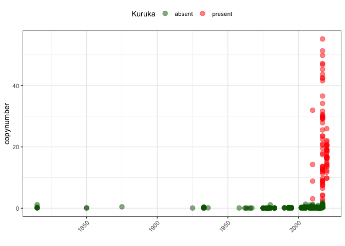
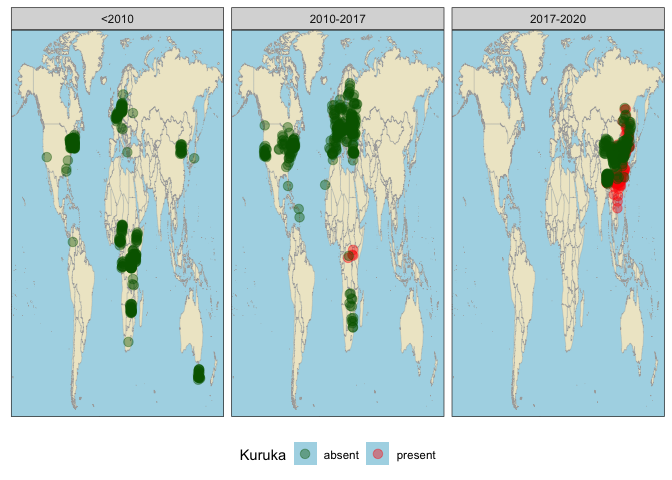
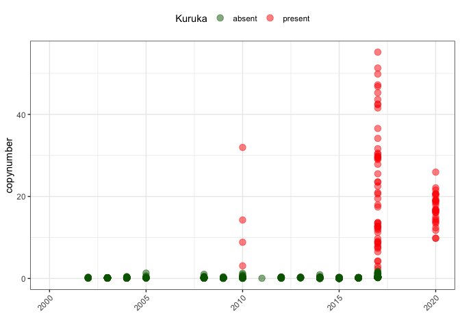
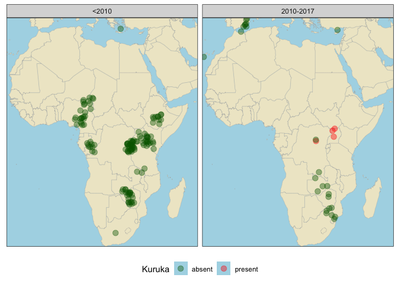
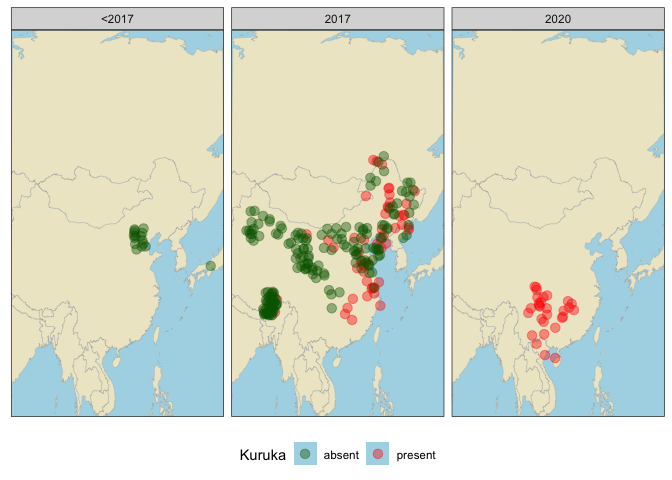

Kuruka
================

``` r
suppressPackageStartupMessages(library(tidyverse))
suppressPackageStartupMessages(library(knitr))
suppressPackageStartupMessages(library(kableExtra))
suppressPackageStartupMessages(library(ggpubr))
suppressPackageStartupMessages(library(svglite))
theme_set(theme_bw())
```

    find /mnt/data2/riccardo/dmel-shortreads/ -name "*.fastq.gz" | parallel -j 5 'n={/.}; bwa bwasw -t 10 ref/c8-derecta_scg.fasta {} | samtools sort -@ 10 -m 3G -o mapped/${n}.sort.bam'

    ls -1 *.bam | parallel -j 40 deviaTE_analyse --input {} --single_copy_genes JAEIGS010000001.1:5141171-5166026,JAEIGS010000021.1:2250845-2261726,JAEIGS010000021.1:11118637-11106239 --library ../../ref/kuruka-SCGs.fasta --family "Kuruka"

    # Define the folder containing the copynumber files
    folder_path <- "/Volumes/Storage/kuruka/deviaTE/raw-data/"

    columns <- c("TEfam", "sample_id", "pos", "refbase", "A", "C", "G", "T", "cov", "phys_cov", "hq_cov", "snp", "refsnp", "int_del", "int_del_freq", "trunc_left", "trunc_right", "ins", "delet", "annotation")

    # List all *.ori.out files in the folder
    file_list <- list.files(path = folder_path, pattern = ".Kuruka", full.names = TRUE)

    # Iterate over each file in oriout_folder
    all_cn_data <- tibble()

    for (cn_file in file_list) {
      cn <- read_table(cn_file, col_names = columns, skip = 3) %>% mutate(sample = cn_file)
      print(cn_file)
      all_cn_data <- bind_rows(all_cn_data, cn)
      }
      
    write_tsv(all_cn_data, "/Volumes/Storage/kuruka/deviaTE/kuruka-deviate.tsv")

``` r
(metadata <- read_tsv("/Volumes/Storage/mining/GenomeDelta2.0/utilities/dmel-metadata.tsv"))
```

    ## Rows: 879 Columns: 9
    ## ── Column specification ────────────────────────────────────────────────────────
    ## Delimiter: "\t"
    ## chr (6): sample, strain, publication, study, study_id, location
    ## dbl (3): year, lat, lon
    ## 
    ## ℹ Use `spec()` to retrieve the full column specification for this data.
    ## ℹ Specify the column types or set `show_col_types = FALSE` to quiet this message.

    ## # A tibble: 879 × 9
    ##    sample      strain   publication    study study_id  year location   lat   lon
    ##    <chr>       <chr>    <chr>          <chr> <chr>    <dbl> <chr>    <dbl> <dbl>
    ##  1 SRR23876563 H10      https://doi.o… PRJN… Shpak20…  1815 Lund, S…    55    13
    ##  2 SRR23876564 H4       https://doi.o… PRJN… Shpak20…  1815 Lund, S…    55    13
    ##  3 SRR23876566 H6       https://doi.o… PRJN… Shpak20…  1815 Smaland…    60    15
    ##  4 SRR23876582 H13      https://doi.o… PRJN… Shpak20…  1815 Lund, S…    55    13
    ##  5 SRR23876583 H12      https://doi.o… PRJN… Shpak20…  1815 Lund, S…    55    13
    ##  6 SRR23876584 H11      https://doi.o… PRJN… Shpak20…  1815 Lund, S…    55    13
    ##  7 SRR23876562 H9       https://doi.o… PRJN… Shpak20…  1850 Passau,…    49    13
    ##  8 SRR23876569 H25      https://doi.o… PRJN… Shpak20…  1850 Passau,…    49    13
    ##  9 SRR23876565 H5       https://doi.o… PRJN… Shpak20…  1875 Zealand…    55    12
    ## 10 ERR6474638  Oregon-R https://doi.o… PRJN… Burny20…  1925 <NA>        NA    NA
    ## # ℹ 869 more rows

    read_deviate <- function(path, meta){
      te <- read_tsv(path) %>% select(TEfam, sample_id, pos, A, C, G, T, cov, hq_cov, snp) %>% mutate(sample_id = gsub(".fastq.sort.bam", "", sample_id)) %>% inner_join(meta, by = "sample_id") %>% select(-study, -study_id, -publication)
    }

    kuruka <- read_deviate("/Volumes/Storage/kuruka/deviaTE/kuruka-deviate.tsv", metadata)

    colorcode <- c("#1a8a7fd5", "#d66d1eff", "#9390b7ff", "#e6ab02ff")

    find_diagnostic <- function(old_sample, new_sample, deviaTE, output){
      
    snps_new <- deviaTE %>% filter(snp==TRUE, sample_id==new_sample) %>%
       mutate(max = pmax(A, C, G, T, na.rm = TRUE), new_allele = case_when(max==A ~ "A", max==C ~ "C", max==T ~ "T", max==G ~ "G"), new_maf = max/cov) %>% select(TEfam, pos, new_allele, new_maf)

    snps_old <- deviaTE %>% filter(sample_id==old_sample, pos %in% snps_new$pos) %>%
        mutate(max = pmax(A, C, G, T, na.rm = TRUE), old_allele = case_when(max==A ~ "A", max==C ~ "C", max==T ~ "T", max==G ~ "G"), old_maf = max/cov) %>% select(TEfam, pos, old_allele, old_maf)

    diagnostic_snps <- inner_join(snps_new, snps_old, by=c("TEfam","pos")) %>% filter(new_allele!=old_allele, old_maf > 0.95)

    toplot <- deviaTE %>% 
      inner_join(diagnostic_snps, by="pos") %>%
      filter(pos %in% diagnostic_snps$pos) %>%
      pivot_longer(c(A, C, G, T)) %>%
      rename(allele_cov = value, base = name) %>%
      mutate(prop = allele_cov / cov)

    unique_pos <- unique(toplot$pos)

    # If there are more than 20 unique "pos" values, sample 20 of them randomly for visualization
    if (length(unique_pos) > 10) {
      set.seed(123)
      sampled_pos <- sample(unique_pos, 10)
      toplot <- toplot %>% filter(pos %in% sampled_pos) %>% filter(!(sample_id %in% c("SRR8061818", "SRR8061819")))
    }

    plot_snps <- ggplot(toplot, aes(x = reorder(sample_id, year), y = prop, fill = base)) +
      geom_bar(stat = "identity") +
      scale_fill_manual(values=colorcode) +
      facet_wrap(~ pos, ncol = 1) +
      labs(x = "sample", y = "allele frequency", title = "Kuruka") +
      theme(legend.position = "top", axis.text.x = element_blank(), axis.ticks.x = element_blank())

    ggsave(output, plot_snps, dpi=300, height = 12, width = 5)

    diagnostic_snps
    }

    (kuruka_diagnostic <- find_diagnostic("SRR8439136", "SRR23103981", kuruka, "/Volumes/Storage/kuruka/deviaTE/Kuruka-diagnostic.png"))

    # Define the folder containing the copynumber files
    folder_path <- "/Volumes/Storage/kuruka/deviaTE/raw-data/"

    columns <- c("TEfam", "sample_id", "pos", "refbase", "A", "C", "G", "T", "cov", "phys_cov", "hq_cov", "snp", "refsnp", "int_del", "int_del_freq", "trunc_left", "trunc_right", "ins", "delet", "annotation")

    # List all *.ori.out files in the folder
    file_list <- list.files(path = folder_path, pattern = ".Kuruka", full.names = TRUE)

    # Iterate over each file in oriout_folder
    all_cn_data <- tibble()

    for (cn_file in file_list) {
      cn <- read_table(cn_file, col_names = columns, skip = 3) %>% mutate(sample = cn_file) %>% filter(pos < 7200 | pos > 7275) %>% group_by(sample) %>% summarise(copynumber = mean(hq_cov), more_than1 = sum(hq_cov >= 1)) %>% mutate(presence = ifelse(more_than1 > 7005, "present", "absent"))
      all_cn_data <- bind_rows(all_cn_data, cn)
      }

    print(all_cn_data)
    write_tsv(all_cn_data, "/Volumes/Storage/kuruka/deviaTE/kuruka-copynumber-nolowcomplexity.tsv")

7200-7275 \<- low complexity region with high copynumber

``` r
copynumber_kuruka <- read_tsv("/Volumes/Storage/kuruka/deviaTE/kuruka-copynumber-nolowcomplexity.tsv") %>% mutate(sample = gsub("/Volumes/Storage/kuruka/deviaTE/raw-data//", "", sample), sample = gsub(".fastq.sort.bam.Kuruka", "", sample))
```

    ## Rows: 843 Columns: 4
    ## ── Column specification ────────────────────────────────────────────────────────
    ## Delimiter: "\t"
    ## chr (2): sample, presence
    ## dbl (2): copynumber, more_than1
    ## 
    ## ℹ Use `spec()` to retrieve the full column specification for this data.
    ## ℹ Specify the column types or set `show_col_types = FALSE` to quiet this message.

``` r
(metadata_copynumber <- inner_join(metadata, copynumber_kuruka, by="sample") %>% mutate(period = case_when(year<2010 ~ "<2010", year>=2010 & year<2017 ~ "2010-2017", TRUE ~ "2017-2020")) %>% arrange(desc(copynumber)))
```

    ## # A tibble: 839 × 13
    ##    sample      strain publication      study study_id  year location   lat   lon
    ##    <chr>       <chr>  <chr>            <chr> <chr>    <dbl> <chr>    <dbl> <dbl>
    ##  1 SRR23103981 mel33  https://doi.org… PRJN… Chen2024  2017 Wuhai, …    39   100
    ##  2 SRR23103904 mel67  https://doi.org… PRJN… Chen2024  2017 Changsh…    28   113
    ##  3 SRR23103920 mel21  https://doi.org… PRJN… Chen2024  2017 Linhe, …    40   107
    ##  4 SRR23103783 mel88  https://doi.org… PRJN… Chen2024  2017 Jiamusi…    46   130
    ##  5 SRR23103906 mel65  https://doi.org… PRJN… Chen2024  2017 Changsh…    28   113
    ##  6 SRR23103937 mel197 https://doi.org… PRJN… Chen2024  2017 Dalian,…    38   121
    ##  7 SRR23103910 mel62  https://doi.org… PRJN… Chen2024  2017 Erdaoba…    42   128
    ##  8 SRR23104043 mel217 https://doi.org… PRJN… Chen2024  2017 Lhasa, …    29    91
    ##  9 SRR23103905 mel66  https://doi.org… PRJN… Chen2024  2017 Changsh…    28   113
    ## 10 SRR23103844 mel37  https://doi.org… PRJN… Chen2024  2017 Shanghai    30   120
    ## # ℹ 829 more rows
    ## # ℹ 4 more variables: copynumber <dbl>, more_than1 <dbl>, presence <chr>,
    ## #   period <chr>

``` r
world_map <- map_data("world") %>% filter(region != "Antarctica")
naeu_map <- world_map %>% filter(lat > 25 & lat < 70, long > -130 & long < 45)
europe_map <- world_map %>% filter(lat > 36 & lat < 70, long > -10 & long < 40)

(kuruka_timeline <- ggplot(metadata_copynumber, aes(x = year, y = copynumber, color = presence)) +
        geom_point(alpha = 0.5, size = 3) +
        labs(y = "copynumber", x = "", color = "Kuruka") +
        #scale_color_gradient(low = "darkgreen", high = "red") +
        scale_color_manual(values = c("darkgreen", "red")) +
        theme(legend.position = "top", 
              axis.text.x = element_text(angle = 45, hjust = 1)))
```

<!-- -->

``` r
(c8_map <- ggplot() +
        geom_map(data = world_map, map = world_map, 
                 aes(long, lat, map_id = region), 
                 fill = "cornsilk2", color = "darkgrey", linewidth = 0.1) +
        geom_point(data = metadata_copynumber, 
                   aes(x = lon, y = lat, color = presence), 
                  size = 3, position = position_jitter(width = 2, height = 2), alpha = 0.4) +
        #scale_color_gradientn(colours = c("darkgreen", "red", "darkred")) +
    scale_color_manual(values = c("darkgreen", "red")) +
       theme(plot.title = element_text(hjust = 0.5), 
              axis.text = element_blank(), 
              axis.title = element_blank(), 
              axis.ticks = element_blank(), 
              legend.position = "bottom", 
              panel.grid = element_blank(), 
             panel.background = element_rect(fill = "lightblue")) +
        facet_wrap(~period) +
        labs(color = "Kuruka") +
       coord_cartesian(expand = FALSE))
```

    ## Warning in geom_map(data = world_map, map = world_map, aes(long, lat, map_id =
    ## region), : Ignoring unknown aesthetics: x and y

    ## Warning: Removed 2 rows containing missing values or values outside the scale range
    ## (`geom_point()`).

<!-- -->

``` r
ggsave("/Volumes/Storage/kuruka/figures/map.png", c8_map, width = 12)
```

    ## Saving 12 x 5 in image

    ## Warning: Removed 2 rows containing missing values or values outside the scale range
    ## (`geom_point()`).

``` r
ggsave("/Volumes/Storage/kuruka/figures/timeline.png", kuruka_timeline)
```

    ## Saving 7 x 5 in image

``` r
write_tsv(metadata_copynumber, "/Volumes/Storage/kuruka/deviaTE/kuruka-copynumber-nolowcomplexity-metadata.tsv")
```

``` r
(c8_timeline_zoom <- ggplot(metadata_copynumber, aes(x = year, y = copynumber, color = presence)) +
        geom_point(alpha = 0.5, size = 3) +
        labs(y = "copynumber", x = "", color = "Kuruka") +
        #scale_color_gradient(low = "darkgreen", high = "red") +
        scale_color_manual(values = c("darkgreen", "red")) +
        theme(legend.position = "top", 
              axis.text.x = element_text(angle = 45, hjust = 1)) +
        xlim(2000, 2020))
```

    ## Warning: Removed 135 rows containing missing values or values outside the scale range
    ## (`geom_point()`).

<!-- -->

``` r
africa_map <- world_map %>% filter(lat > -45 & lat < 40, long > -20 & long < 55)
c8_africa <- metadata_copynumber %>% filter(lat > -45 & lat < 40, lon > -20 & lon < 55)

asia_map <- world_map %>% filter(lat > 10 & lat < 75, long > 80 & long < 140)
c8_asia <- metadata_copynumber %>% filter(lat > 10 & lat < 75, lon > 80 & lon < 140) %>% mutate(period = case_when(year==2017 ~ "2017", year==2020 ~ "2020", TRUE~"<2017"))
  
(c8_africa_map <- ggplot() +
        geom_map(data = africa_map, map = africa_map, 
                 aes(long, lat, map_id = region), 
                 fill = "cornsilk2", color = "darkgrey", linewidth = 0.1) +
        geom_point(data = c8_africa, 
                   aes(x = lon, y = lat, color = presence), 
                   size = 3, position = position_jitter(width = 2, height = 2), alpha = 0.4) +
        scale_color_manual(values = c("darkgreen", "red")) +
        #scale_color_gradientn(colours = c("darkgreen", "red", "darkred")) +
        theme(plot.title = element_text(hjust = 0.5), 
              axis.text = element_blank(), 
              axis.title = element_blank(), 
              axis.ticks = element_blank(), 
              legend.position = "bottom", 
              panel.grid = element_blank(), 
              panel.background = element_rect(fill = "lightblue")) +
        facet_wrap(~period) +
        labs(color = "Kuruka") +
        coord_cartesian(expand = FALSE))
```

    ## Warning in geom_map(data = africa_map, map = africa_map, aes(long, lat, :
    ## Ignoring unknown aesthetics: x and y

<!-- -->

``` r
(c8_asia_map <- ggplot() +
        geom_map(data = asia_map, map = asia_map, 
                 aes(long, lat, map_id = region), 
                 fill = "cornsilk2", color = "darkgrey", linewidth = 0.1) +
        geom_point(data = c8_asia, 
                   aes(x = lon, y = lat, color = presence), 
                   size = 3, position = position_jitter(width = 2, height = 2), alpha = 0.4) +
        #scale_color_gradientn(colours = c("darkgreen", "red", "darkred")) +
        scale_color_manual(values = c("darkgreen", "red")) +
        theme(plot.title = element_text(hjust = 0.5), 
              axis.text = element_blank(), 
              axis.title = element_blank(), 
              axis.ticks = element_blank(), 
              legend.position = "bottom", 
              panel.grid = element_blank(), 
              panel.background = element_rect(fill = "lightblue")) +
        facet_wrap(~period) +
        labs(color = "Kuruka") +
        coord_cartesian(expand = FALSE))
```

    ## Warning in geom_map(data = asia_map, map = asia_map, aes(long, lat, map_id =
    ## region), : Ignoring unknown aesthetics: x and y

<!-- -->

``` r
ggsave("/Volumes/Storage/kuruka/figures/map-africa.png", c8_africa_map)
```

    ## Saving 7 x 5 in image

``` r
ggsave("/Volumes/Storage/kuruka/figures/map-asia.png", c8_asia_map)
```

    ## Saving 7 x 5 in image

``` r
ggsave("/Volumes/Storage/kuruka/figures/timeline-recent.png", c8_timeline_zoom)
```

    ## Saving 7 x 5 in image

    ## Warning: Removed 135 rows containing missing values or values outside the scale range
    ## (`geom_point()`).

    deviaTE_analyse --input SRR23103981.fastq.sort.bam --single_copy_genes JAEIGS010000021.1:3993639-3984763,JAEIGS010000049.1:3568949-3579275,JAEIGS010000103.1:16029183-16016880 --library ../ref/c8-derecta_scg.fasta --family c8_derecta
